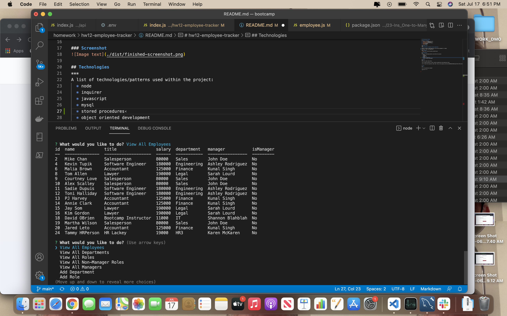

# hw12-employee-tracker

## Table of Contents
1. [General Info](#general-info)
2. [Screenshot](#screenshot)
3. [Technologies](#technologies)
4. [Usage](#usage)
5. [FAQs](#faqs)

### General Info
***
### David OBrien's Employee Tracker application

inquirer (console) based application facilitating management of company
Employees, Roles, and Departments.

### Screenshot

## Technologies
***
A list of technologies/patterns used within the project:
  * node
  * inquirer
  * javascript
  * mysql
  * stored procedures‹
  * object oriented development

## Usage
***
See link to demo video below:

Link to github repository- https://github.com/dmobrienllc/hw12-employee-tracker

Link to Employee Tracker demo video- https://drive.google.com/file/d/1haIO4974s7yFLtL4Ilx1G8kbQUhpbqkp/view?usp=sharing

## FAQs
***

Q Is this application awesome?

A Why yes it is!
---

